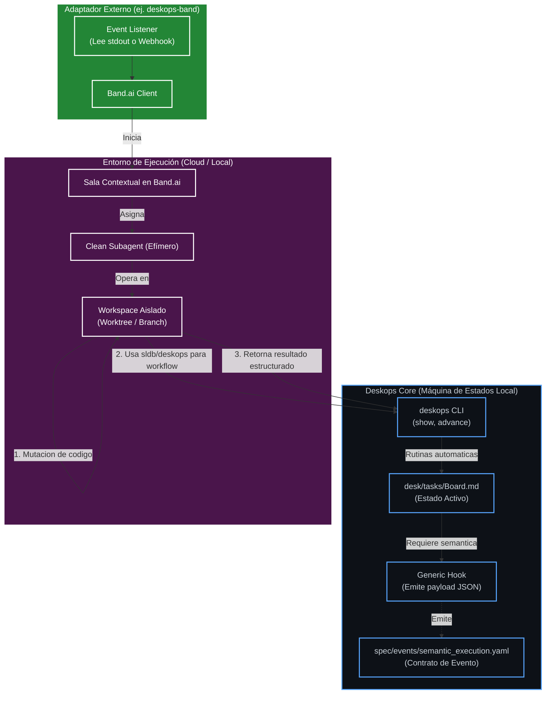

# Semantic Execution Adapter

## Propósito

Definir una integración futura entre `deskops` y ejecutores semánticos externos, con Band.ai como primer adaptador posible, sin acoplar el core de `deskops` a Band.ai.

`deskops` conserva la máquina de estados local, las rutinas deterministas, la validación y el cierre. El adaptador externo consume eventos, coordina subagentes limpios y devuelve resultados estructurados que `deskops` debe validar antes de avanzar estado.

## Fuentes

Fuentes externas:

- `http://docs.band.ai/welcome` — conceptos core de identidades temporales y salas de contexto.
- `http://docs.band.ai/api/introduction` — diseño del cliente/adaptador externo.

Fuentes internas:

- `docs/diagrams/process/llm-tasks-vs-automatic-routines.md` — límites entre trabajo semántico delegado y rutinas deterministas locales.
- `docs/diagrams/tasks/task-accumulation-initialization-resolution.md` — ciclo del subagente limpio y revisión de ambigüedad antes de tocar código.
- `docs/diagrams/tasks/task-board-phases.md` — fases y paralelismo entre tareas que no se pisan.
- `desk/rituals/closeout.md` — cierre con validación, limpieza y commit atómico.

## Arquitectura Propuesta

## Funcionamiento

1. `deskops` llega a una fase que requiere juicio semántico, como revisión de ambigüedad, edición de código o triage de fallos.
2. Un hook genérico local emite un payload JSON definido por `spec/events/semantic_execution.yaml`.
3. Un adaptador externo, por ejemplo `deskops-band`, consume el payload y llama a la API de Band.ai.
4. Band.ai asigna la ejecución a un subagente limpio en una sala contextual.
5. El subagente trabaja en un sandbox aislado, como `git worktree` o rama separada, para evitar colisiones de concurrencia.
6. El subagente usa `deskops` y `sldb` para operaciones workflow/documentales, no ediciones directas sobre `desk/` o `.sldb/` cuando exista CLI propietaria.
7. El adaptador retorna un resultado estructurado.
8. `deskops` retoma control, ejecuta rutinas deterministas locales, valida, y solo entonces permite avanzar estado o cerrar con commit atómico.

## Restricciones

- Band.ai no entra como dependencia del core de `deskops`.
- El contrato debe ser genérico para permitir otros adaptadores.
- Las rutinas deterministas, tests, closeout y commits siguen siendo locales.
- La ejecución paralela requiere aislamiento de worktree/rama y ownership explícito antes de habilitar mutación concurrente.
- El primer slice implementable debería ser contrato de evento local y superficies JSON de lectura, no integración Band.ai directa.
