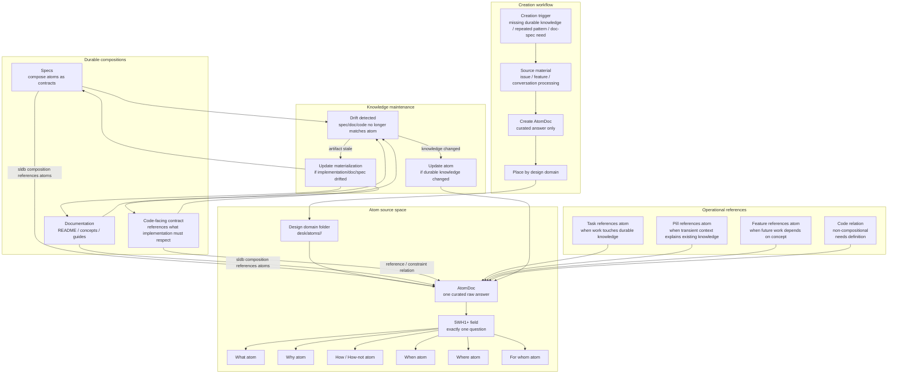

# Atoms Workflow

This diagram document is a human-facing materialization of these atoms:

- `desk/atoms/workflow-model/atom-docs-are-human-facing-atom-materializations.md`
- `desk/atoms/workflow-model/atom-rendered-diagrams-are-projections.md`
- `desk/atoms/workflow-model/atom-spec2viz-mirrors-sldb-for-diagrams.md`

Atoms are not transient work items. They are the minimum structured knowledge units.

## Rules

- Atoms live under `desk/atoms`, grouped by design domain.
- Atoms are durable knowledge, not tasks.
- Each atom answers exactly one `5WH1+` question: what, why, how, how-not, when, where, or for whom.
- Specs and documentation should reference or compose tracked atom documents through SLDB rather than copy atom prose.
- Structured documents should expose useful model fields in their SLDB payloads, but those fields remain inside the owning document model.
- Good model-field design plus explicit atom references keep composed documents small and prevent duplication-driven drift.
- Tasks, pills, and features may reference atoms.
- If a task changes code/spec/docs that touch durable knowledge, it should reference the relevant atoms.
- Drift can mean either the atom is stale or a materialization is stale; the workflow must decide which side changes.
- Drafts of would-be atoms are not atoms; they are issues, features, notes, or conversation-processing documents until curated into `AtomDoc`.
- Atom-to-code relationships are not simple compositions. They need their own relation model because code may implement, respect, violate, or depend on an atom without being generated from it.
