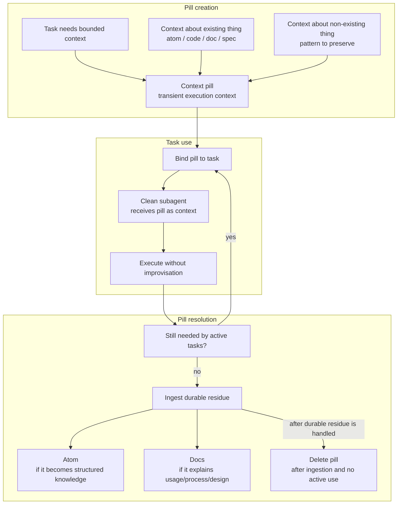

# Context Pills Workflow

This diagram document is a human-facing materialization of these atoms:

- `desk/atoms/workflow-model/atom-docs-are-human-facing-atom-materializations.md`
- `desk/atoms/workflow-model/atom-rendered-diagrams-are-projections.md`
- `desk/atoms/workflow-model/atom-spec2viz-mirrors-sldb-for-diagrams.md`
- `desk/atoms/workflow-model/atom-pills-carry-transitional-task-knowledge.md`
- `desk/atoms/workflow-model/atom-pills-end-as-atoms-docs-or-deletion.md`

Pills are transient context for clean-agent execution. They may carry transitional task knowledge, but they are not the durable knowledge base by themselves; stabilized residue should graduate into atoms.

## Rules

- Pills are created to bound a clean subagent's context.
- If a pill is about something already written, it should reference it instead of copying it. Copying creates drift.
- If a pill is about something that exists, it should reference it: atom, code, docs, specs, etc.
- If a pill is about something that does not exist yet, it should capture a pattern.
- Pills are deleted when no longer used.
- Before deletion, any stabilized ruling or reusable pattern discovered through the pill must be ingested into atoms first, with documentation following as needed.
