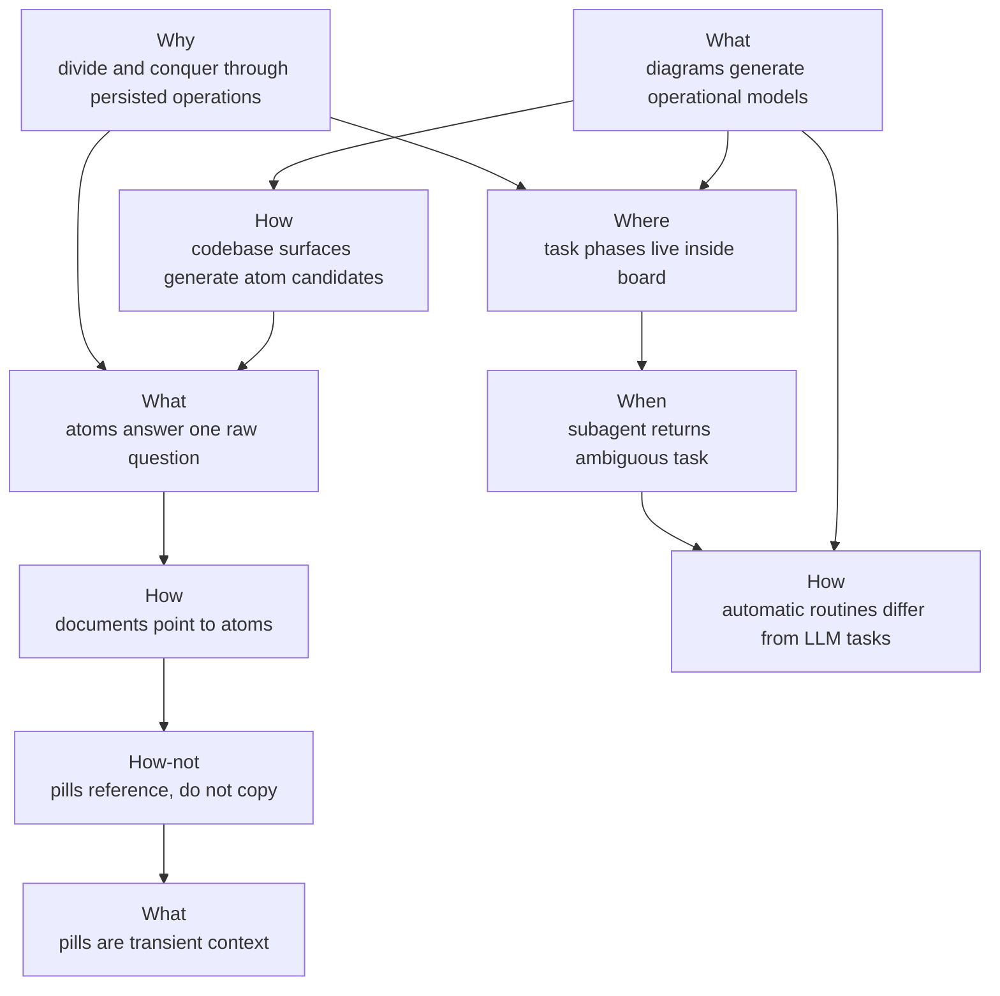

# Workflow Model Atoms

This diagram document is a human-facing materialization of these atoms:

- `desk/atoms/workflow-model/atom-docs-are-human-facing-atom-materializations.md`
- `desk/atoms/workflow-model/atom-rendered-diagrams-are-projections.md`
- `desk/atoms/workflow-model/atom-spec2viz-mirrors-sldb-for-diagrams.md`

This diagram maps the first curated atoms for the deskops workflow model.

## Atom Files

- `desk/atoms/workflow-model/atom-divide-and-conquer-persisted-operations.md`
- `desk/atoms/workflow-model/atom-atoms-answer-one-question.md`
- `desk/atoms/workflow-model/atom-documents-point-to-atoms.md`
- `desk/atoms/workflow-model/atom-pills-reference-not-copy.md`
- `desk/atoms/workflow-model/atom-pills-are-transient.md`
- `desk/atoms/workflow-model/atom-task-board-phases.md`
- `desk/atoms/workflow-model/atom-clean-subagent-ambiguity-review.md`
- `desk/atoms/workflow-model/atom-automatic-routines-vs-llm-tasks.md`
- `desk/atoms/workflow-model/atom-diagrams-generate-operational-models.md`
- `desk/atoms/workflow-model/atom-codebase-surfaces-generate-atom-candidates.md`

## Questions Raised

- How should large documents declare their sldb composition from atoms?
- Is `5WH1+` the final field name for the single question answered by each atom?
- Which codebase relations are strong enough to become curated atoms now?
