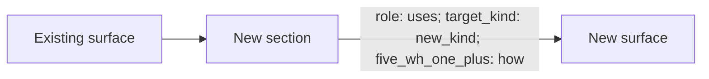

# Codebase Document Relation Map

This diagram document is a human-facing materialization of these atoms:

- `desk/atoms/workflow-model/atom-docs-are-human-facing-atom-materializations.md`
- `desk/atoms/workflow-model/atom-rendered-diagrams-are-projections.md`
- `desk/atoms/workflow-model/atom-spec2viz-mirrors-sldb-for-diagrams.md`

This draft treats the codebase as a set of large document/surface families. Each surface has internal sections. Crosses between sections are labeled with:

- `role`: how the source surface relates to the target surface
- `target_kind`: what kind of surface is being pointed at
- `five_wh_one_plus`: which raw atom question the relation suggests

The goal is to use these crosses as a generator for candidate atoms. The atom itself stays small and does not point outward. Larger documents and surfaces declare which atoms they use.

```mermaid
flowchart TB
    subgraph README["README document"]
        readme_what["Project identity\nwhat is this?"]
        readme_use["How to use\nentry commands / flows"]
        readme_entry["Entrypoints\nwhere to start"]
    end

    subgraph SPEC["Spec documents"]
        spec_contract["Contract\nwhat must hold"]
        spec_constraints["Constraints\nhow / how-not"]
        spec_interfaces["Interfaces\nwhere integration happens"]
    end

    subgraph DOCS["Documentation"]
        docs_concepts["Concept docs\nwhy / what"]
        docs_arch["Architecture docs\nhow / where"]
        docs_howto["How-to guides\nhow / when"]
    end

    subgraph BACKEND["Backend code"]
        backend_modules["Modules\nwhere behavior lives"]
        backend_api["API / service boundary\nhow consumers interact"]
        backend_data["Data/runtime flow\nhow state moves"]
    end

    subgraph FRONTEND["Frontend / UX code"]
        front_views["Views / screens\nwhat users see"]
        front_flows["User flows\nwhen / how interaction happens"]
        front_affordances["Affordances\nhow-not / constraints"]
    end

    subgraph TESTS["Test code"]
        unit_tests["Unit tests\nlocal behavior"]
        integration_tests["Integration tests\ncross-surface behavior"]
        e2e_tests["E2E tests\nuser/system path"]
    end

    subgraph CONFIG["Config / deployment"]
        env_config["Environment\nwhere it runs"]
        deployment["Deployment\nwhen/how it is operated"]
    end

    subgraph DEPS["Libraries / dependencies"]
        deps_contracts["External contracts\nwhat dependency promises"]
        deps_limits["Dependency limits\nhow-not"]
    end

    subgraph WORKFLOW["Workflow docs"]
        task_docs["Tasks\nactive work units"]
        board_docs["Boards\nrouting/indexing"]
        pill_docs["Pills\ntransient context"]
        ritual_docs["Rituals\nprocess descriptions"]
    end

    subgraph GENERATED["Generated / rendered artifacts"]
        generated_docs["Rendered docs\nprojection"]
        generated_diagrams["Rendered diagrams\nprojection"]
        generated_indexes["Indexes\nnavigation / lookup"]
    end

    readme_what -->|role: documents; target_kind: doc; five_wh_one_plus: what| docs_concepts
    readme_use -->|role: uses; target_kind: code_backend; five_wh_one_plus: how| backend_api
    readme_use -->|role: uses; target_kind: code_front; five_wh_one_plus: how| front_flows
    readme_entry -->|role: documents; target_kind: config; five_wh_one_plus: where| env_config

    spec_contract -->|role: constrains; target_kind: code_backend; five_wh_one_plus: what| backend_modules
    spec_contract -->|role: constrains; target_kind: code_front; five_wh_one_plus: what| front_views
    spec_constraints -->|role: constrains; target_kind: code_backend; five_wh_one_plus: how_not| backend_data
    spec_constraints -->|role: constrains; target_kind: code_front; five_wh_one_plus: how_not| front_affordances
    spec_interfaces -->|role: specifies; target_kind: code_backend; five_wh_one_plus: where| backend_api
    spec_contract -->|role: validates; target_kind: test; five_wh_one_plus: what| unit_tests
    spec_interfaces -->|role: validates; target_kind: test; five_wh_one_plus: how| integration_tests

    docs_concepts -->|role: documents; target_kind: readme; five_wh_one_plus: why| readme_what
    docs_arch -->|role: documents; target_kind: code_backend; five_wh_one_plus: how| backend_data
    docs_arch -->|role: documents; target_kind: code_front; five_wh_one_plus: where| front_views
    docs_howto -->|role: documents; target_kind: ux; five_wh_one_plus: when| front_flows

    backend_modules -->|role: implements; target_kind: spec; five_wh_one_plus: how| spec_contract
    backend_api -->|role: implements; target_kind: spec; five_wh_one_plus: where| spec_interfaces
    backend_data -->|role: validates; target_kind: test; five_wh_one_plus: how| integration_tests
    front_flows -->|role: validates; target_kind: test; five_wh_one_plus: when| e2e_tests
    front_affordances -->|role: validates; target_kind: test; five_wh_one_plus: how_not| e2e_tests

    deps_contracts -->|role: constrains; target_kind: code_backend; five_wh_one_plus: what| backend_api
    deps_limits -->|role: constrains; target_kind: code_backend; five_wh_one_plus: how_not| backend_modules
    env_config -->|role: constrains; target_kind: code_backend; five_wh_one_plus: where| backend_data
    deployment -->|role: constrains; target_kind: workflow; five_wh_one_plus: when| ritual_docs

    task_docs -->|role: uses; target_kind: spec; five_wh_one_plus: what| spec_contract
    task_docs -->|role: uses; target_kind: code_backend; five_wh_one_plus: where| backend_modules
    task_docs -->|role: uses; target_kind: test; five_wh_one_plus: how| unit_tests
    board_docs -->|role: uses; target_kind: workflow; five_wh_one_plus: where| task_docs
    pill_docs -->|role: uses; target_kind: doc; five_wh_one_plus: why| docs_concepts
    pill_docs -->|role: uses; target_kind: spec; five_wh_one_plus: how_not| spec_constraints
    ritual_docs -->|role: specifies; target_kind: workflow; five_wh_one_plus: how| task_docs

    docs_concepts -->|role: renders; target_kind: generated; five_wh_one_plus: what| generated_docs
    spec_contract -->|role: renders; target_kind: generated; five_wh_one_plus: what| generated_diagrams
    board_docs -->|role: renders; target_kind: generated; five_wh_one_plus: where| generated_indexes
```



## How This Generates Atoms

Each edge can be read as a candidate atom request:

```yaml
five_wh_one_plus: how_not
question: What must not happen when frontend affordances implement spec constraints?
source_surface: spec_constraints
target_kind: code_front
role: constrains
candidate_atom_location: desk/atoms/<design-domain>/...
```

The atom stores only the curated answer. The source and target surfaces store the reference to the atom.

## Extension Rule

The map must be easy to extend without breaking the original order.

Extension should happen by appending, not by reshaping:

- Add a new surface as a new top-level document family.
- Add a new section inside an existing surface only when it belongs to that surface's existing role.
- Add new cross-surface edges without renaming existing nodes.
- Keep `role`, `target_kind`, and `five_wh_one_plus` explicit on every edge.
- Do not encode hidden meaning in graph position, visual order, or edge proximity.
- Preserve existing node ids so generated atom candidates remain stable across revisions.

The expected extension pattern is:



This keeps the base map as an ordered vocabulary while allowing local projects to add surfaces such as CLI, database, observability, security, analytics, mobile, or infrastructure without rewriting the core map.

## Corrections From Previous Draft

- Atoms do not have `status`; they are curated knowledge. Drafts live elsewhere. Obsolete atoms are deleted.
- Atoms do not own outgoing relations.
- Relation maps belong to documents/surfaces or sidecar indexes that point to atoms.
- This map is a generator for deciding which atoms are missing, not the atom schema itself.
