# Codebase Knowledge Surfaces

This is a draft outward-facing model. It starts from the large documents and knowledge surfaces that compose a codebase, then asks what atom relations and indexes are needed to connect them without duplicating prose.

The reference shape comes from `core/specyaml`, especially its split between semantic elements, relations, anchors, evidence, coverage, composition, profiles, renderers, lint, and machine contracts.

```mermaid
flowchart TB
    subgraph Codebase["Codebase knowledge surfaces"]
        readme["README / start here\nproject identity, use, entrypoints"]
        docs["Documentation\nconcepts, guides, architecture"]
        specs["Specs / contracts\nsemantic source and constraints"]
        code["Code\nimplementation surface"]
        tests["Tests / verification\nexpected behavior and checks"]
        ux["UX / user flows\ninteraction and affordances"]
        backend["Backend / runtime\ndata flow, APIs, services"]
        libraries["Libraries / dependencies\nexternal contracts and boundaries"]
        config["Config / deployment\nenvironment and operational setup"]
        workflows["Workflow docs\ntasks, rituals, boards, pills"]
        generated["Generated artifacts\ndiagrams, rendered docs, indexes"]
    end

    subgraph AtomLayer["Atom layer"]
        atom["AtomDoc\none curated raw answer"]
        question["5WH1+\nwhat / why / how / how_not / when / where / for_whom"]
        namespace["Tag namespaces\ncontrolled but extensible"]
    end

    subgraph ReferenceLayer["References and compositions live in other documents"]
        atomref["Atom reference\ndocument points to atom"]
        composition["sldb composition\nreferences atom docs or model payload fields"]
        role["role\nhow the surface uses the atom"]
        target_kind["target_kind\nwhat kind of surface uses it"]
    end

    atom --> question
    atom --> namespace
    atomref --> atom
    atomref --> role
    atomref --> target_kind
    composition --> atomref

    readme --> atomref
    docs --> composition
    specs --> composition
    code --> atomref
    tests --> atomref
    ux --> atomref
    backend --> atomref
    libraries --> atomref
    config --> atomref
    workflows --> atomref
    generated --> composition

    role -->|examples| supports["supports"]
    role --> constrains["constrains"]
    role --> specifies["specifies"]
    role --> validates["validates"]
    role --> renders["renders"]
    role --> composes["composes"]
    role --> transcludes["transcludes"]
    role --> implements["implements"]
    role --> documents["documents"]
    role --> uses["uses"]
    role --> violates["violates / drift"]
```



## Large Document Families

| Surface | What it holds | Atom role |
|---|---|---|
| README / start here | project identity, use path, entrypoints | should reference or render atoms for what/why/how-to-use |
| Concept docs | durable explanations and architecture concepts | often direct materializations of atoms |
| Specs / contracts | normative semantic rules and constraints | specs may reference or transclude atom docs; atoms can specify or constrain claims |
| Code | implementation | code implements/respects/violates atoms; not simple composition |
| Tests / verification | executable or procedural proof | tests validate atoms, specs, or behavior claims |
| UX docs | user flows, affordances, interaction contracts | atoms can describe users, flows, constraints, and how-not |
| Backend/runtime docs | APIs, state, data flow, service boundaries | atoms can constrain or explain runtime design |
| Libraries/dependencies | external contracts and boundaries | atoms can document dependency rationale and limits |
| Config/deployment | environment and operational setup | atoms can explain where/when operational constraints apply |
| Workflow docs | tasks, boards, rituals, pills | atoms are referenced; pills are transient and must not copy |
| Generated artifacts | diagrams, indexes, rendered docs | should preserve canonical atom/spec identity |

For README-like documents, the intended pattern is not free prose duplication. A README can be organized as a projection over atoms, for example: project identity atom, implementation atom, usage atom, backend/runtime atom, UX atom, and verification atom.

## Initial Document-to-Atom Role Families

Borrowing from `specyaml`, larger documents should declare explicit roles for how they point to atoms. These are not outgoing relations from the atom.

| Relation | Meaning |
|---|---|
| `documents` | atom is explained in a durable doc |
| `specifies` | atom defines a rule or contract in a spec |
| `constrains` | atom limits what code/design/process may do |
| `supports` | artifact supports or justifies an atom |
| `validates` | test/check validates an atom or derived claim |
| `implements` | code implements an atom's claim |
| `uses` | artifact uses the atom as context or dependency |
| `composes` | structured document composes tracked docs or model payload fields through SLDB |
| `transcludes` | document includes atom content while preserving identity |
| `renders` | generated artifact presents atom/spec semantics |
| `violates` | artifact conflicts with the atom and indicates drift |

## Atom Frontmatter Implications

Atoms should stay small. An atom does not point outward to code, docs, tasks, or specs. Other documents point to atoms.

This matters because the drift-control rule is asymmetric: durable knowledge lives in atoms, and every larger document that uses that knowledge must declare which atoms it depends on. The atom should not need to know every place where it is used.

Current atom fields:

```yaml
id: atom-...
title: ...
five_wh_one_plus: what | why | how | how_not | when | where | for_whom
answer: ...
tags: []
```

Atom body:

```markdown
The raw answer to exactly one question.
```

Notes:

- `title` is useful for display, but hierarchy/order should primarily come from the folder layout and document-to-atom references.
- There is no `domain` field in this draft. Domain comes from `desk/atoms/<design-domain>/...`.
- There is no `status` field in this draft. Atoms are curated knowledge; drafts live elsewhere, and obsolete atoms are deleted rather than deprecated or retired.
- There is no `parent` field in this draft. Parent/child semantics should emerge from folder hierarchy or from external references, not from an atom pointing outward.
- There are no `relations`, `anchors`, or `evidence` fields in atom frontmatter in this draft.
- `target_kind` belongs in the referencing document's atom reference, not inside the atom.

## Document Atom References

Every larger document that uses atom knowledge should declare its atom references. This is where relation/index metadata belongs.

Draft shape for documents that point to atoms:

```text
atoms:
  - id: atom-...
    target_kind: readme | doc | spec | code | test | ux | backend | library | config | workflow | generated
    role: documents | specifies | constrains | supports | validates | implements | uses | composes | transcludes | renders | violates
```

The exact `role` vocabulary is still open, but the direction is not: documents point to atoms.

## Open Questions

- Are document-to-atom references stored in each document frontmatter, in a sidecar index, or both?
- Should code relations use `implements/respects/violates`, or a different vocabulary?
- Which large documents are allowed to transclude atom content versus only reference atom identity?
