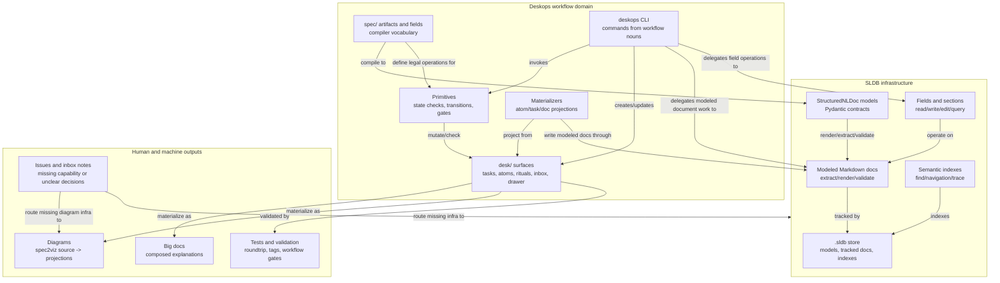

# SLDB Primitives Docs CLI Components

This diagram shows how the major deskops components interact with SLDB infrastructure, document models, specs, primitives, materializers, and CLI commands.

## Reading Rules

- SLDB owns reusable structured-document infrastructure: models, stores, docs, fields, sections, and semantic indexes.
- Deskops owns workflow-domain concepts: specs, primitives, materializers, CLI grammar, and desk surfaces.
- The CLI should be a thin operational surface over specs, primitives, and SLDB document operations.
- Big documents should not bypass the model; they should be modeled either as shallow composed documents or as stricter typed documents when their internal structure needs machine validation.
- Missing reusable document behavior routes to SLDB; missing diagram-source behavior routes to spec2viz; missing workflow behavior stays in deskops.

## Source Atoms

- `desk/atoms/workflow-model/atom-deskops-owns-workflow-not-document-infrastructure.md`
- `desk/atoms/workflow-model/atom-sldb-is-read-write-edit-surface.md`
- `desk/atoms/workflow-model/atom-spec-fields-compile-into-model-fields.md`
- `desk/atoms/workflow-model/atom-upstream-routing-needs-convenient-command.md`
- `desk/atoms/knowledge-model/atom-main-docs-are-composed-materializations.md`
