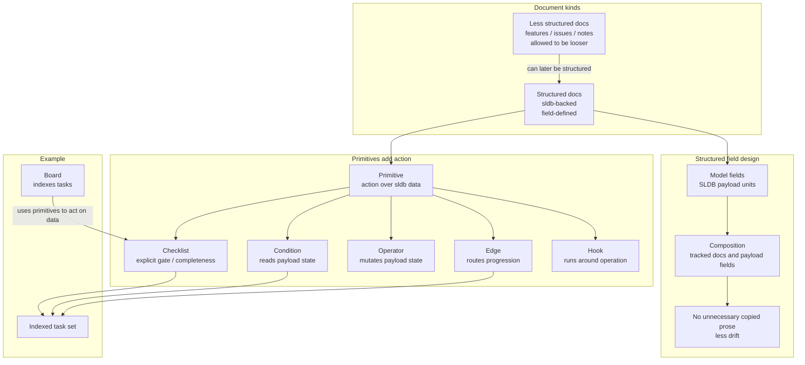

# Document Structure and Primitives

The desk has both structured and less structured documents.

Structured documents are backed by `sldb`. Less structured documents can exist where precision is not yet useful, such as future features, loose issues, or notes in drawers.

## Rules

- If something is already written, reference it instead of copying it.
- Copying already-written content creates drift.
- Structured docs should expose model fields that are small enough to query and edit safely through SLDB.
- A document composed from another structured document should use SLDB composition/query surfaces rather than duplicate prose or create separate field-instance docs.
- Less structured docs are acceptable for future/deferred/unclear work, but can later be converted into structured docs when the workflow needs precision.
- Primitives are what give action to `sldb` data.
- A board can index tasks by using primitives such as checklists, conditions, edges, or other action units.
