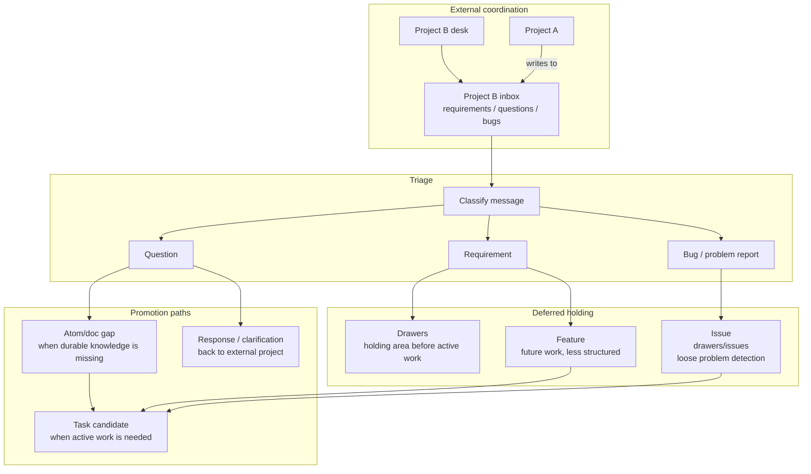

# Inbox, Drawers, Features, and Issues Workflow

This diagram document is a human-facing materialization of these atoms:

- `desk/atoms/workflow-model/atom-docs-are-human-facing-atom-materializations.md`
- `desk/atoms/workflow-model/atom-rendered-diagrams-are-projections.md`
- `desk/atoms/workflow-model/atom-spec2viz-mirrors-sldb-for-diagrams.md`

This workflow covers coordination and deferred work. It is separate from active task execution.

## Rules

- Inbox is for coordination between projects.
- A project can write requirements, questions, or bugs into another project's inbox.
- Drawers hold things until they become active work.
- Features are future work and can be less structured than tasks.
- Issues live under `drawers/issues` and can be loosely structured detections of problems.
- Promotion to task happens only when work becomes active.
