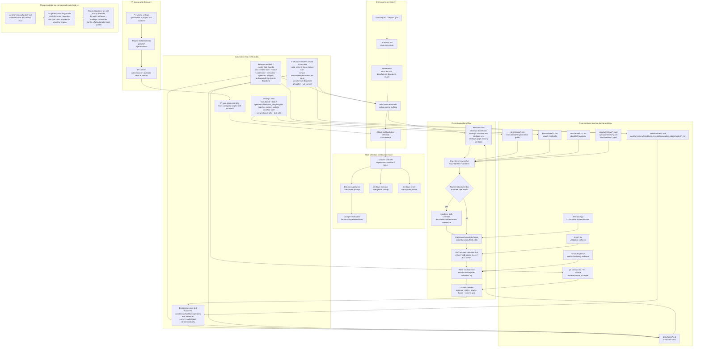

# Current Agent Workflow and Automation Map

This diagram document is a human-facing materialization of these atoms:

- `desk/atoms/workflow-model/atom-docs-are-human-facing-atom-materializations.md`
- `desk/atoms/workflow-model/atom-rendered-diagrams-are-projections.md`
- `desk/atoms/workflow-model/atom-spec2viz-mirrors-sldb-for-diagrams.md`
- `desk/atoms/workflow-model/atom-clean-agents-start-from-minimum-workflow-set.md`
- `desk/atoms/workflow-model/atom-first-safe-action-follows-read-route.md`
- `desk/atoms/workflow-model/atom-phase-gates-prevent-agent-skipping.md`
- `desk/atoms/workflow-model/atom-tasks-enable-zero-context-subagents.md`

This diagram shows the **current** deskops workflow as it exists today across Pi skill discovery, desk recovery, global surface skills, role system prompts, task execution, structured-document work, deterministic workflow automation, and closeout.

It intentionally distinguishes:

- what Pi auto-discovers
- what the repo asks agents to load on demand
- what deskops automates today
- what is only modeled as future hook/routine architecture

## Surfaces touched by stage

### 1. Pi discovery

- Pi runtime settings
- `.pi/skills/*/SKILL.md`
- `.agents/skills/*/SKILL.md`

What is automatic here:

- Pi discovers skills from configured project locations at startup.

What is not automatic here:

- Pi does not reliably load the full content of every skill unless prompted by task match or explicit use.

## 2. Entry and recovery

Primary surfaces:

- `AGENTS.md`
- `README.md`
- `docs/faq.md`
- `desk/tasks/Board.md`
- `desk/rituals/execution.md`
- `desk/rituals/testing.md`
- `desk/rituals/closeout.md`

Primary skill:

- `use-deskops`

## 3. Role-specific work

### Supervisor lane

Primary role prompt:

- `deskops-supervisor`

Main surfaces:

- `desk/tasks/Board.md`
- active task docs in `desk/tasks/`
- run evidence in `runs/subagents/`
- git evidence for closeout review

### Executor lane

Primary role prompt:

- `deskops-executor`

Main surfaces:

- assigned task in `desk/tasks/`
- bound pills in `desk/contexts/`
- bound atoms in `desk/atoms/`
- code/spec/doc files named by the task
- validation targets in `tests/`
- evidence in `runs/subagents/`

### Tester lane

Primary role prompt:

- `deskops-tester`

Main surfaces:

- assigned task
- testing and closeout rituals
- tests
- validation logs and handoff evidence

### Worker-lane launch

Primary skill:

- `subagent-execution`

Main surfaces:

- `runs/subagents/<timestamp>-<task-id>/`
- `board.txt`, `task.txt`, `next.txt`, `graph.txt`, `git-status.txt`, `stdout.log`, `stderr.log`, `result-summary.md`, `validation.log`

## 4. Structured-document lane

Use `.pi/skills/use-sldb/SKILL.md` when the task touches:

- `StructuredNLDoc` models
- tracked Markdown docs
- SLDB field operations
- store update/check flows
- model templates and model fields

Typical touched surfaces:

- `.sldb/`
- tracked Markdown docs under `desk/`
- model code under `deskops/models/`

## 5. Workflow automation that exists today

### `deskops add task`

Implemented by `create_task_bundle()`.

Automatically creates and writes:

- task doc
- routine doc
- task-specific conditions
- task-specific checklists
- task-specific operators
- task-specific edges
- board update adding the task to `desk/tasks/Board.md`

### `deskops next`

Implemented by `next_action_report()` plus `spec/workflows/task_lifecycle.yaml`.

Automatically:

- reads the active board
- resolves the task
- matches `current_node` to a workflow state
- reports ritual, phase, next actions, and merged pills

### `deskops advance task`

Implemented by `advance_task()` plus routine/condition/checklist/operator evaluation.

Automatically:

- evaluates deterministic conditions
- checks checklist completion
- applies operators
- updates task status/current node

### automatic closeout side effect inside `advance_task()`

If the advanced task ends at:

- `status == closed`
- `current_node == complete`

then `_auto_commit_task_closure()` runs automatically and performs cleanup plus a git commit.

That is the closest thing to a currently active automatic closeout hook in the repo runtime.

## 6. Hooks: current truth

There **are** hook documents as workflow artifacts under:

- `desk/primitives/hooks/`

But there is **not yet** a generic hook runtime that:

- watches events
- resolves matching hook docs
- checks conditions
- dispatches targets automatically

So the current workflow should be described as:

- **partly automated by specific deskops code paths**
- **not yet automated by a general hook engine**

## Practical interpretation

Today the workflow is a hybrid:

- **Pi** auto-discovers skills
- **agents** still have to choose/load the right skill and follow repo rituals
- **deskops** automates several deterministic task-lifecycle operations
- **hook docs** exist as modeled workflow artifacts, but most ritual enforcement is still behavioral/manual rather than event-driven runtime automation
