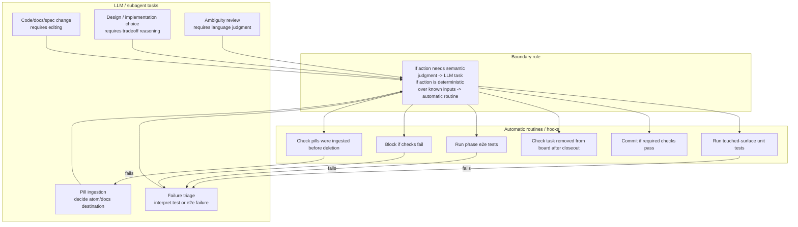

# LLM Tasks vs Automatic Routines

This diagram document is a human-facing materialization of these atoms:

- `desk/atoms/workflow-model/atom-docs-are-human-facing-atom-materializations.md`
- `desk/atoms/workflow-model/atom-rendered-diagrams-are-projections.md`
- `desk/atoms/workflow-model/atom-spec2viz-mirrors-sldb-for-diagrams.md`

Some workflow actions are work for a clean LLM subagent. Others are deterministic routines or hooks that should run automatically.

## Rule

- LLM tasks handle semantic judgment, ambiguity, design choices, implementation, and interpretation.
- Automatic routines handle deterministic checks and operations over known inputs.
- Automatic routines may block or return work to an LLM task, but they should not invent new semantic decisions.

## Examples

- `run touched unit tests after task`: automatic routine.
- `run e2e after phase`: automatic routine.
- `commit if tests pass`: automatic routine, once commit naming and branch rules are defined.
- `decide why a test failed`: LLM task.
- `decide whether a pill should become an atom or docs`: LLM task.
- `check that a pill has an ingestion target before deletion`: automatic routine.
