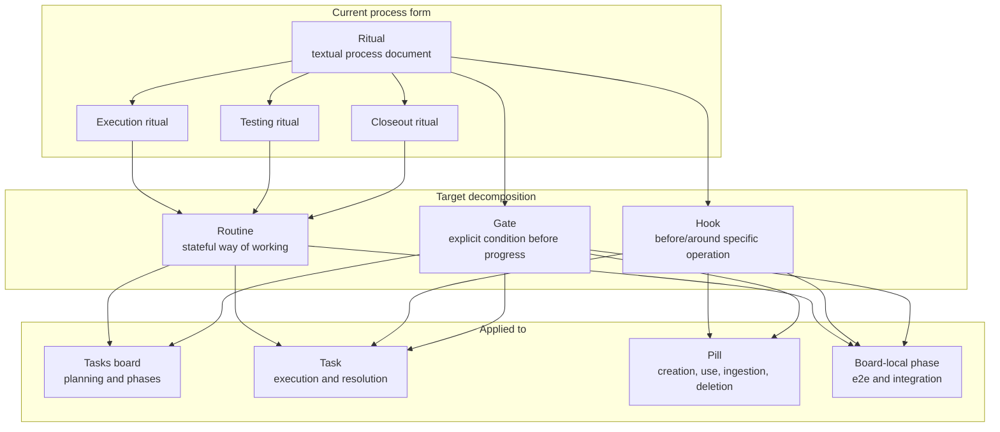

# Rituals, Routines, and Hooks Workflow

This diagram document is a human-facing materialization of these atoms:

- `desk/atoms/workflow-model/atom-docs-are-human-facing-atom-materializations.md`
- `desk/atoms/workflow-model/atom-rendered-diagrams-are-projections.md`
- `desk/atoms/workflow-model/atom-spec2viz-mirrors-sldb-for-diagrams.md`

Rituals are the current textual form of operating process. They should be decomposed once the workflow is clear.

## Rules

- Rituals currently explain how to operate tasks, pills, code, testing, and closeout.
- Rituals have drifted and should not be treated as final architecture.
- Once the workflow is clear, rituals should decompose into routines and hooks.
- Routines model stateful ways of working.
- Hooks run before or around specific operations.
- Gates make preconditions explicit before progress.
- Routines and hooks should distinguish automatic deterministic work from LLM/subagent work.
- Automatic hooks can run tests, validate board cleanup, block deletion, and commit when checks pass.
- LLM/subagent tasks handle ambiguity, implementation, and semantic decisions.
