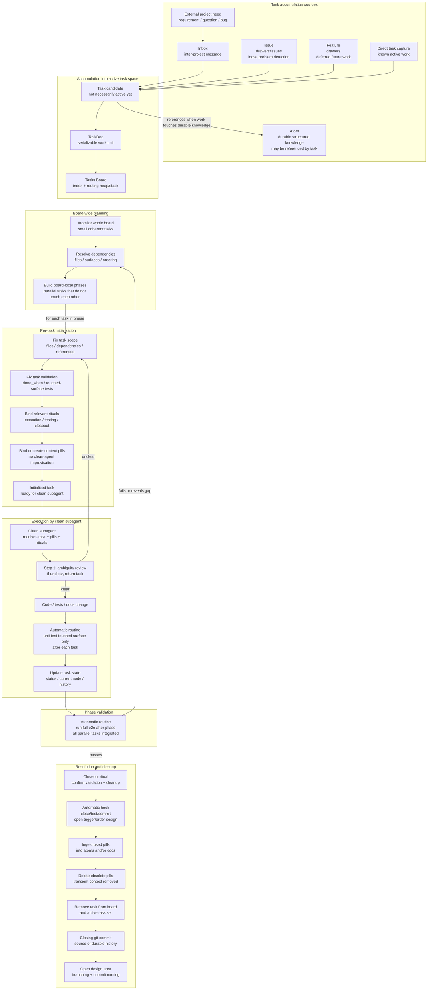

# Task Accumulation, Initialization, and Resolution

This diagram document is a human-facing materialization of these atoms:

- `desk/atoms/workflow-model/atom-docs-are-human-facing-atom-materializations.md`
- `desk/atoms/workflow-model/atom-rendered-diagrams-are-projections.md`
- `desk/atoms/workflow-model/atom-spec2viz-mirrors-sldb-for-diagrams.md`

This diagram focuses only on how tasks enter the active work system, become executable by a clean subagent, and disappear after resolution.

## Notes

- Accumulation is not the same as initialization: a task can exist as a candidate before it is safe to execute.
- Atomization happens over the whole board, not only one task. Dependencies and touched surfaces are used to build phases inside the tasks board; `phase` is not a standalone document.
- Initialization turns each task in a phase into a small, bounded, serializable unit with scope, validation, rituals, and context pills.
- The first action of every clean subagent is ambiguity review. If implementation is ambiguous, the subagent returns the task instead of improvising.
- After each task, only the touched surface should be unit tested.
- After each phase, the full e2e suite should run because parallel changes are now integrated.
- Unit tests, e2e tests, board cleanup checks, and commit-if-green behavior are automatic routines/hooks, not LLM tasks.
- Ambiguity review, implementation, failure triage, and pill ingestion decisions are LLM/subagent tasks.
- Resolution does not merely mark a task as done. It must clean context, ingest transient pills into durable knowledge/docs, remove active routing, and leave the durable record in git.
- The close/test/commit hook is required, but its exact trigger and order still need workflow design: per-task, per-phase, or both.
- Branching and commit naming are still an open workflow design area.
