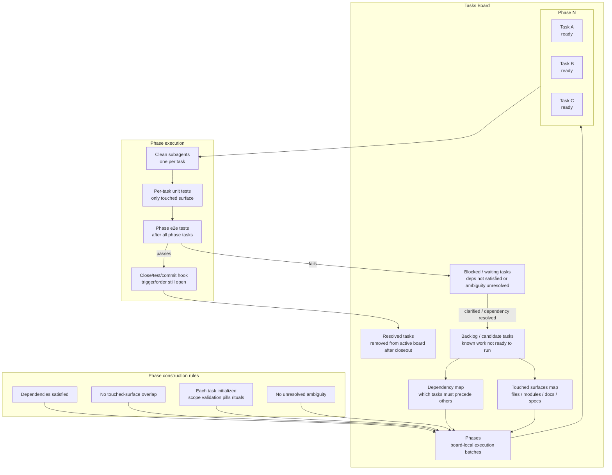

# Task Board Phases

`Phase` is not a standalone document. It is a board-local grouping inside the tasks board.

The tasks board owns active routing. A phase is the board's current execution batch: tasks that can run at the same time because their dependencies are satisfied and their touched surfaces do not overlap.



## Board Shape

The board should probably grow sections like these rather than creating `PhaseDoc`:

```markdown
## Tasks

- task-a
- task-b
- task-c

## Dependencies

- task-c depends_on task-a

## Touched Surfaces

- task-a: deskops/models/task.py, tests/test_task.py
- task-b: docs/README.md
- task-c: deskops/cli/parser.py

## Phases

### Phase 1

- task-a
- task-b

### Phase 2

- task-c
```

## Rules

- A phase is computed or recorded inside the tasks board.
- A phase contains only initialized tasks.
- Tasks in the same phase must not touch the same files, modules, specs, docs, or other meaningful surfaces.
- Each task in a phase starts with clean-subagent ambiguity review.
- If ambiguity exists, the task returns to planning and does not execute.
- Each task runs only its touched-surface unit tests after implementation.
- The full e2e suite runs after the whole phase completes.
- The close/test/commit hook is required, but its exact per-task/per-phase trigger is still unresolved.
