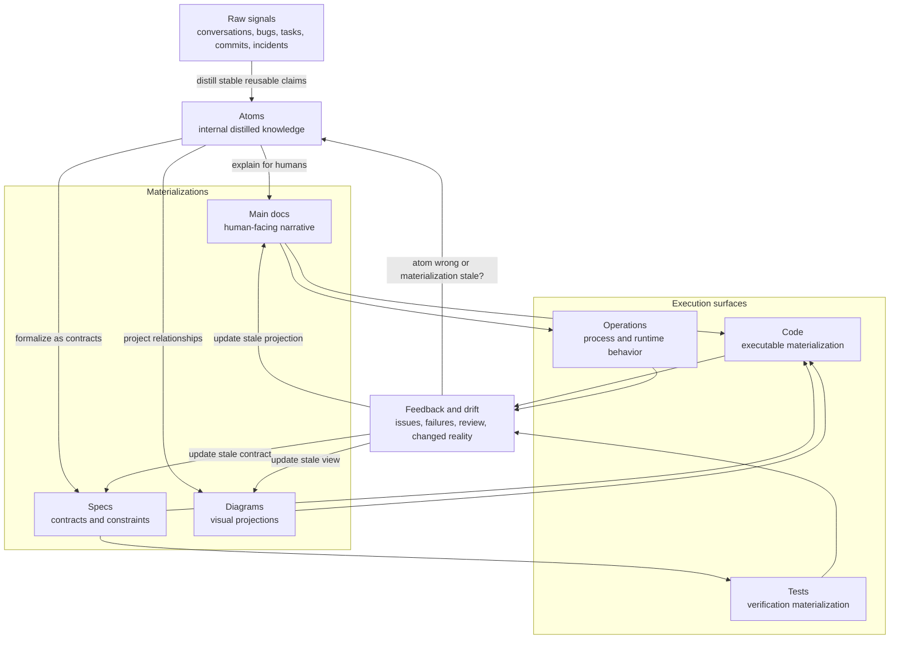

# Knowledge Materialization Model

This diagram document is a human-facing materialization of these atoms:

- `desk/atoms/workflow-model/atom-docs-are-human-facing-atom-materializations.md`
- `desk/atoms/workflow-model/atom-rendered-diagrams-are-projections.md`
- `desk/atoms/workflow-model/atom-spec2viz-mirrors-sldb-for-diagrams.md`

This diagram shows the generic project model where atoms distill internal knowledge and docs, specs, and diagrams materialize that knowledge for different uses.

## Rules

- Atoms are internal distilled knowledge, not public-facing docs.
- Main docs, specs, and diagrams are materializations of selected atoms.
- Code implements or violates the relevant atoms and specs.
- Tests verify selected atoms, specs, and behaviors.
- Feedback decides whether an atom changed or a materialization drifted.
