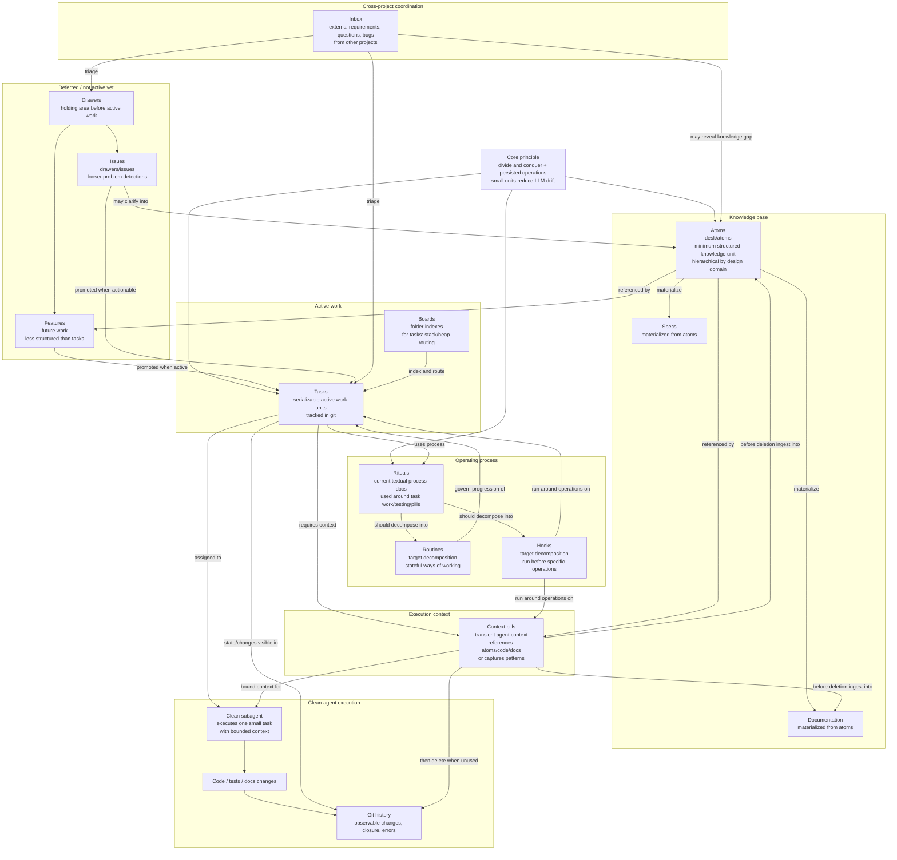

# Deskops Workflow Model

This is the semantic workflow model as currently understood. It intentionally avoids infrastructure details and focuses on what each artifact does in the operating system.

## Definitions

- `Atoms`: minimum structured knowledge units. They live in `desk/atoms`, ordered hierarchically by design domain. Specs and documentation should be materializations of atoms.
- `Tasks`: persistent units for active work. They are organized by boards and tracked in git so changes, completion, and error introduction are observable.
- `Context pills`: transient context for clean subagents. They must be ingested into atoms, documentation, or both before deletion.
- `Features`: less-structured future work kept in drawers until it is promoted to active work.
- `Issues`: loosely structured problem detections under `drawers/issues`.
- `Inbox`: cross-project coordination surface for requirements, questions, and bugs from external projects.
- `Boards`: indexes for folders. For `tasks`, a board acts as routing structure, stack, or heap for ordering active work.
- `Rituals`: current textual descriptions of operating process. They should eventually be decomposed into routines and hooks.
- `Routines`: target representation for stateful ways of working.
- `Hooks`: target representation for process fragments that run before or around specific operations.

## Constraints

- Avoid duplicated writing: duplicate prose opens space for language-agent error.
- Prefer small persisted units: they support divide and conquer and make git history meaningful.
- A task should be executable by a clean subagent with no room for improvisation beyond the bounded context.
- Pills are not durable knowledge. Their durable residue must be absorbed into atoms or documentation before removal.
