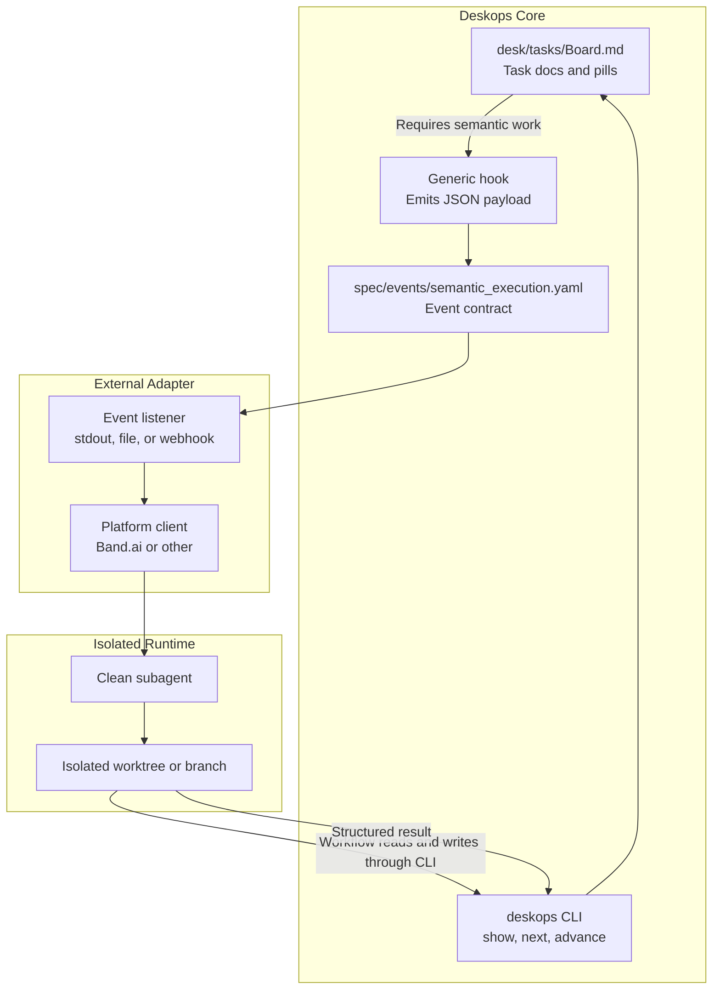

# Semantic Execution Adapter

## Purpose

`deskops` may delegate work that requires semantic judgment, such as ambiguity review, implementation choices, code or documentation edits, and failure triage. Delegation must not let an external agent or platform become the source of workflow truth.

`deskops` remains the local deterministic orchestrator. External platforms are adapters that consume and return structured events.

## Boundary

- `deskops`, `sldb`, and `desk/` own workflow state, task routing, document integrity, validation gates, and transitions.
- External semantic executors own only the delegated judgment or edit attempt inside an isolated execution environment.
- `deskops` does not trust adapter results directly. It validates local state and runs deterministic routines before accepting a requested transition.
- Band.ai is not a core dependency. A Band adapter may exist outside `deskops` and consume the generic event contract.

## Base References

- `docs/diagrams/process/llm-tasks-vs-automatic-routines.md` defines the boundary between deterministic routines and semantic work.
- `docs/workflow-policy-reference.md` defines task workflow policy, context audit, and completion constraints.
- `desk/rituals/execution.md` defines the ambiguity review and execution gate.
- `desk/rituals/testing.md` defines validation before closeout.
- `desk/rituals/closeout.md` defines board cleanup and atomic closeout.
- `spec/events/semantic_execution.yaml` defines the event contract.

## Architecture

## Event Flow

1. `deskops` reaches a state that requires semantic work.
2. A generic hook emits a `semantic_execution.requested` payload.
3. An external adapter consumes the payload and starts one isolated worker.
4. The worker reads context through allowed commands, starting with ambiguity review.
5. The worker edits source or test files inside its isolated environment.
6. Workflow or knowledge artifacts are mutated only through `deskops` or `sldb` commands.
7. The adapter returns a `semantic_execution.completed` payload.
8. `deskops` validates locally and decides whether to advance, retry, or request triage.

## Editing Policy

- Workflow and knowledge artifacts under `desk/`, `.sldb/`, and structured specs must not be edited directly by an external worker when a local command owns that mutation.
- Source code and tests may be edited with normal file operations inside the worker's isolated environment.
- The adapter result may report changed files and request a transition, but only `deskops` can decide whether the transition is valid.

## Concurrency Policy

- Multiple workers must not share one writable worktree.
- Each active worker needs an isolated `git worktree`, branch, container workspace, or equivalent sandbox.
- Adapters must track task ownership and file leases before parallel execution is enabled.
- Retries and cancellations must be idempotent: a repeated event for the same idempotency key must not create duplicate work, duplicate transitions, or conflicting commits.

## Security Policy

- The adapter must enforce an allowlist of commands.
- Secrets for external platforms must not be exposed to worker subprocesses unless strictly required.
- Shell access is not assumed. If shell access exists, it must be constrained by the adapter.
- Cloud workers need an explicit workspace access design before they can mutate repository state.

## Incremental Roadmap

1. Define the local event contract in `spec/events/semantic_execution.yaml`.
2. Add JSON read surfaces such as `deskops show task <id> --json` and `deskops next --json` where missing.
3. Add a generic local hook that emits request payloads to stdout or a local file.
4. Build any platform-specific adapter outside `deskops` core.
5. Implement isolated worktree or branch ownership before allowing parallel mutation.
6. Add asynchronous callbacks only after isolation and idempotency are enforced.
